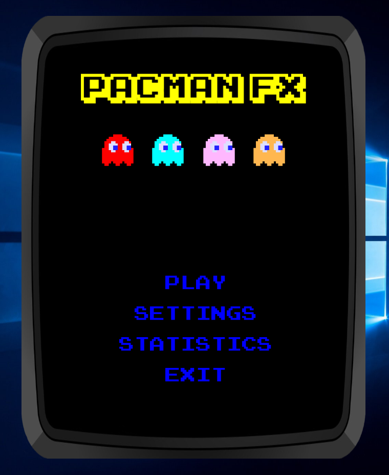
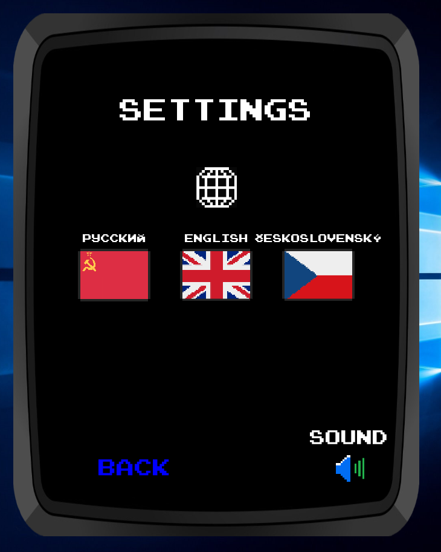
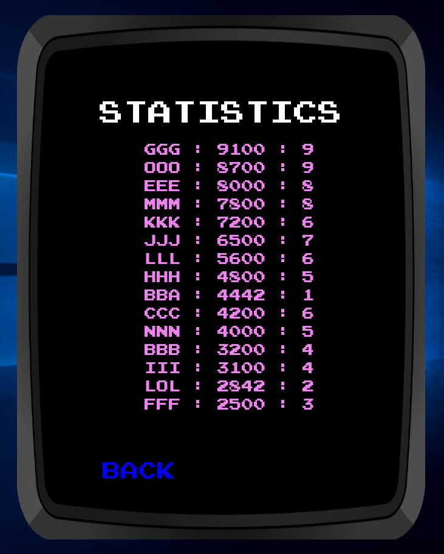
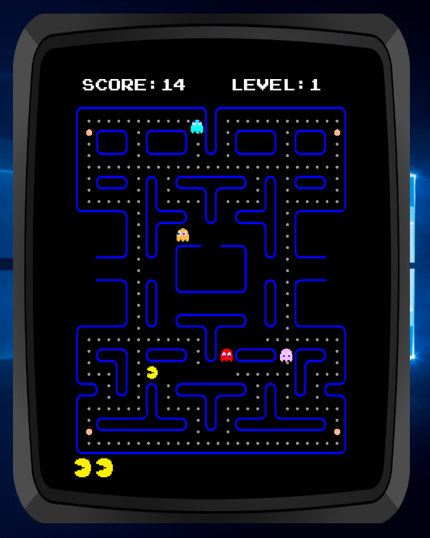
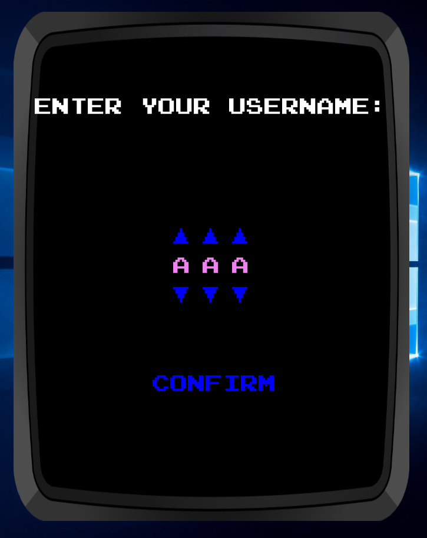
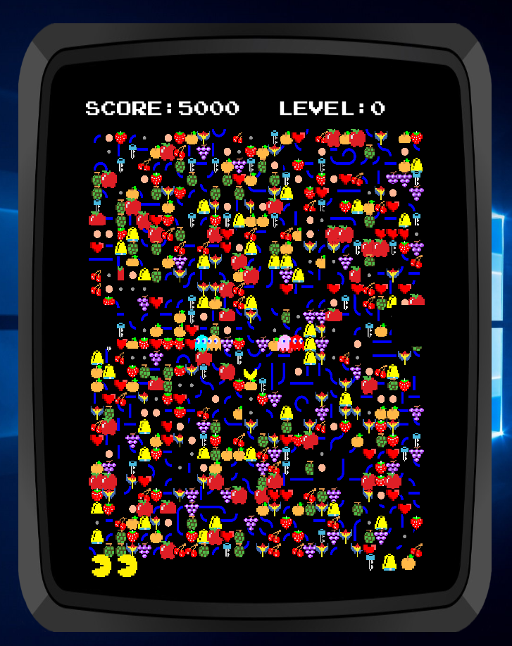

# Pacman-FX

### Intro
This project was meant to be a side project developed out of boredom during my free times, however, it transitioned into a semestral project for BIE-PJV (programming in Java) in CTU (Czech Technical University) in Prague.

### Tools
1. Pure Java with JavaFX.
2. SQLite for databases.

### Screenshots
Main Menu

Settings

Statistics

Game

Entering username

# Level 256 
Level 256 map:

Once you reach level 256 % 256 (which is 0), the map will be rendered in a chaotic way. During the map endering, a random is used to pick a tile. Therefore, the level 256 will be different all the time. Meanwhile the level is fully playable; you can actually try to pass it; good luck with the RNJesus :) 